# Hook Debug - Architecture & System Documentation

This document provides comprehensive documentation of the Hook Debug webhook listener application, including its architecture, user management system, endpoint migration flow, and technical implementation details.

## 📋 Table of Contents

1. [Project Overview](#project-overview)
2. [System Architecture](#system-architecture)
3. [Authentication & User Management](#authentication--user-management)
4. [Endpoint Migration System](#endpoint-migration-system)
5. [Code Components](#code-components)
6. [API Documentation](#api-documentation)
7. [Use Cases & Flows](#use-cases--flows)
8. [Configuration & Environment](#configuration--environment)
9. [Testing & Validation](#testing--validation)
10. [Security & Monitoring](#security--monitoring)

## 🎯 Project Overview

Hook Debug is a real-time webhook testing and monitoring application that provides:

- **Real-time webhook capture** and analysis
- **Multi-user support** with GitHub OAuth integration
- **Anonymous user support** with persistent session management
- **Automatic endpoint migration** between anonymous and authenticated states
- **WebSocket-based real-time updates**
- **Comprehensive request logging** and debugging tools

### Key Features

- 🔗 **Dynamic endpoint creation** with unique URLs
- 📊 **Real-time request monitoring** via WebSocket
- 👤 **Seamless user experience** (anonymous → authenticated)
- 🔄 **Automatic data migration** preserving user endpoints
- 🌐 **Multi-language support** (Portuguese/English)
- 📱 **Responsive design** with modern UI
- 🔒 **Secure authentication** with GitHub OAuth
- 🗄️ **SQLite database** with automatic cleanup

## 🏗️ System Architecture

### High-Level Architecture


### Component Structure


## 🔐 Authentication & User Management

### User States & Transitions


### User Separation Logic


### Anonymous User ID Generation

```mermaid
flowchart TD
    A[User accesses application] --> B{ID exists in localStorage?}
    B -->|Yes| C[Use existing ID]
    B -->|No| D[Generate new ID]
    
    D --> E[Create browser fingerprint]
    E --> F[userAgent + language + screen.width + screen.height]
    F --> G[btoa(fingerprint).replace(/[^a-zA-Z0-9]/g, '').substring(0, 10)]
    G --> H[user_anonymous_ + seed]
    H --> I[Save to localStorage]
    
    C --> J[Persistent ID Available]
    I --> J
    
    style J fill:#ccffcc
    style E fill:#e3f2fd
```

## 🔄 Endpoint Migration System

### Problem Statement

```mermaid
graph TD
    A[Anonymous user creates endpoints] --> B[user_1719880800000_abc123]
    B --> C[Application deploy/refresh]
    C --> D[New random ID: user_1719880900000_xyz789]
    D --> E[❌ Endpoints lost - Different user IDs]
    
    style E fill:#ffcccc
```



### Solution Implementation

```mermaid
graph TD
    A[Anonymous user creates endpoints] --> B[user_anonymous_ABC123XYZ0]
    B --> C[Application deploy/refresh]
    C --> D[Same persistent ID: user_anonymous_ABC123XYZ0]
    D --> E[✅ Endpoints preserved]
    E --> F[User logs in with GitHub]
    F --> G[Automatic migration to github_user_123456]
    G --> H[✅ All endpoints accessible under GitHub account]
    
    style E fill:#ccffcc
    style H fill:#ccffcc
```



### Migration Flow


### Migration Decision Logic

```mermaid
flowchart TD
    A[Login detected] --> B{oldUserId ≠ newUserId?}
    B -->|No| C[No migration needed]
    B -->|Yes| D{oldUserId starts with 'user_anonymous_'?}
    D -->|No| E[Already authenticated user]
    D -->|Yes| F[Execute migration]
    
    F --> G[Call /api/endpoints/migrate]
    G --> H[Update database]
    H --> I[Return migration count]
    I --> J[Display success notification]
    
    style F fill:#e3f2fd
    style J fill:#ccffcc
```



## 🧩 Code Components

### Frontend - UserManager (user-manager.js)

Core user management with persistent ID generation and migration handling.

```javascript
class UserManager {
    // Generate persistent anonymous ID using browser fingerprint
    generateUserId() {
        const browserFingerprint = navigator.userAgent + 
                                 navigator.language + 
                                 screen.width + 
                                 screen.height;
        const seed = btoa(browserFingerprint)
                     .replace(/[^a-zA-Z0-9]/g, '')
                     .substring(0, 10);
        return 'user_anonymous_' + seed;
    }
    
    // Handle migration on authentication state change
    async updateUserContext() {
        if (this.isAuthenticated && this.githubUser) {
            const oldUserId = this.currentUser.id;
            const newUserId = this.githubUser.id;
            
            // Check if migration is needed
            if (oldUserId !== newUserId && oldUserId.startsWith('user_anonymous_')) {
                await this.migrateEndpoints(oldUserId, newUserId);
            }
            
            this.currentUser.github_id = this.githubUser.id;
            this.currentUser.auth_type = 'github';
        }
        this.saveUser(this.currentUser);
    }
    
    // Get user ID for API calls (ensures proper separation)
    getApiUserId() {
        if (this.isAuthenticated && this.githubUser) {
            return this.githubUser.id;  // GitHub endpoints
        }
        // Ensure we have anonymous user
        if (!this.currentUser) {
            this.currentUser = this.getOrCreateUser();
        }
        return this.currentUser ? this.currentUser.id : null;  // Anonymous endpoints
    }
}
```

### Frontend - AuthManager (auth-manager.js)

Authentication state management with proper cleanup on logout.

```javascript
class AuthManager {
    async logout() {
        const response = await fetch('/auth/logout', {
            method: 'POST',
            credentials: 'include'
        });
        
        if (response.ok) {
            // Clear authentication state
            this.currentUser = null;
            this.isAuthenticated = false;
            
            // Clear user manager data for clean state
            if (typeof userManager !== 'undefined') {
                userManager.isAuthenticated = false;
                userManager.githubUser = null;
                userManager.userEndpoints = [];
            }
            
            this.updateAuthUI();
            setTimeout(() => window.location.reload(), 1000);
        }
    }
}
```

### Backend - EndpointController (src/controllers/EndpointController.js)

Handles endpoint operations and migration requests.

```javascript
class EndpointController {
    // Handle endpoint migration between users
    async migrateEndpoints(req, res) {
        try {
            const { from_user_id, to_user_id } = req.body;
            
            const result = await EndpointService.migrateEndpoints(from_user_id, to_user_id);
            
            res.json({
                message: 'Endpoints migrated successfully',
                migratedCount: result.migratedCount
            });
        } catch (error) {
            if (error.message.includes('required') || 
                error.message.includes('cannot be the same')) {
                res.status(400).json({ error: error.message });
            } else {
                res.status(500).json({ error: error.message });
            }
        }
    }
}
```

### Backend - Endpoint Model (src/models/Endpoint.js)

Database operations for endpoint management.

```javascript
class Endpoint {
    // Migrate all endpoints from one user to another
    static async migrateUserEndpoints(fromUserId, toUserId) {
        const result = await Database.query(
            'UPDATE endpoints SET user_id = ? WHERE user_id = ?',
            [toUserId, fromUserId]
        );
        
        return {
            migratedCount: result.changes || 0
        };
    }
    
    // Find all endpoints for a specific user
    static async findByUserId(userId) {
        const rows = await Database.query(
            'SELECT * FROM endpoints WHERE user_id = ? ORDER BY created_at DESC',
            [userId]
        );
        
        return rows.map(row => new Endpoint(row));
    }
}
```

## 📡 API Documentation

### Migration Endpoints

#### POST /api/endpoints/migrate

Migrates all endpoints from one user to another.

**Request:**
```json
{
    "from_user_id": "user_anonymous_ABC123XYZ0",
    "to_user_id": "github_user_123456"
}
```

**Response (Success - 200):**
```json
{
    "message": "Endpoints migrated successfully",
    "migratedCount": 3
}
```

**Response (Validation Error - 400):**
```json
{
    "error": "Both from_user_id and to_user_id are required"
}
```

### User Endpoints

#### GET /api/users/:userId/endpoints

Returns all endpoints for a specific user.

**Parameters:**
- `userId` (string): User identifier (anonymous or GitHub)

**Response (Success - 200):**
```json
[
    {
        "id": "ef444a63-fc18-425c-b770-08af1f0bc80e",
        "name": "My Test Endpoint",
        "user_id": "github_user_123456",
        "created_at": 1751424988100,
        "request_count": 15,
        "url": "http://localhost:3000/webhook/ef444a63-fc18-425c-b770-08af1f0bc80e"
    }
]
```

### Endpoint Management

#### POST /api/endpoints

Creates a new webhook endpoint.

**Request:**
```json
{
    "name": "My New Endpoint",
    "user_id": "user_anonymous_ABC123XYZ0"
}
```

**Response (Created - 201):**
```json
{
    "id": "550e8400-e29b-41d4-a716-446655440000",
    "name": "My New Endpoint",
    "user_id": "user_anonymous_ABC123XYZ0",
    "created_at": 1751424988100,
    "request_count": 0,
    "url": "http://localhost:3000/webhook/550e8400-e29b-41d4-a716-446655440000"
}
```

## 📊 Use Cases & Flows

### Use Case 1: New Anonymous User


### Use Case 2: Anonymous to Authenticated Migration

```mermaid
graph TD
    A[Anonymous user with endpoints] --> B[Login with GitHub]
    B --> C[Automatic migration triggered]
    C --> D[All endpoints transferred to GitHub account]
    D --> E[✅ Seamless transition]
    
    style C fill:#e3f2fd
    style E fill:#ccffcc
```



### Use Case 3: User Separation After Logout


## 🔧 Configuration & Environment

### Environment Variables

```bash
# Server Configuration
NODE_ENV=development
HOST=localhost
PORT=3000

# Database Configuration
DB_PATH=./webhooks.db
DB_MAX_CONNECTIONS=10
DB_TIMEOUT=30000

# GitHub OAuth (Optional)
GITHUB_CLIENT_ID=your_github_client_id
GITHUB_CLIENT_SECRET=your_github_client_secret

# Security
SESSION_SECRET=your_secure_session_secret
CORS_ORIGIN=*

# Cleanup
CLEANUP_SCHEDULE=0 3 * * *
RETENTION_DAYS=60
```

### Database Schema

```sql
-- Endpoints table
CREATE TABLE endpoints (
    id TEXT PRIMARY KEY,
    name TEXT NOT NULL,
    user_id TEXT NOT NULL,  -- Key field for migration and user separation
    created_at INTEGER NOT NULL,
    request_count INTEGER DEFAULT 0
);

-- Requests table
CREATE TABLE requests (
    id TEXT PRIMARY KEY,
    endpoint_id TEXT NOT NULL,
    method TEXT NOT NULL,
    headers TEXT,
    body TEXT,
    query_params TEXT,
    ip_address TEXT,
    user_agent TEXT,
    received_at INTEGER NOT NULL,
    FOREIGN KEY (endpoint_id) REFERENCES endpoints (id) ON DELETE CASCADE
);

-- Indexes for performance
CREATE INDEX idx_endpoints_user_id ON endpoints(user_id);
CREATE INDEX idx_requests_endpoint_id ON requests(endpoint_id);
```

## 🧪 Testing & Validation

### Complete Test Flow

```bash
# 1. Create endpoint with anonymous user
curl -X POST http://localhost:3000/api/endpoints \
  -H "Content-Type: application/json" \
  -d '{"name": "Test Endpoint", "user_id": "user_anonymous_ABC123XYZ0"}'

# 2. Verify anonymous user has endpoint
curl -X GET http://localhost:3000/api/users/user_anonymous_ABC123XYZ0/endpoints

# 3. Create endpoint with GitHub user (simulating different user)
curl -X POST http://localhost:3000/api/endpoints \
  -H "Content-Type: application/json" \
  -d '{"name": "GitHub Endpoint", "user_id": "github_user_123456"}'

# 4. Verify separation - anonymous user should only see their endpoint
curl -X GET http://localhost:3000/api/users/user_anonymous_ABC123XYZ0/endpoints

# 5. Execute migration
curl -X POST http://localhost:3000/api/endpoints/migrate \
  -H "Content-Type: application/json" \
  -d '{"from_user_id": "user_anonymous_ABC123XYZ0", "to_user_id": "github_user_123456"}'

# 6. Verify GitHub user now has both endpoints
curl -X GET http://localhost:3000/api/users/github_user_123456/endpoints

# 7. Verify anonymous user no longer has endpoints
curl -X GET http://localhost:3000/api/users/user_anonymous_ABC123XYZ0/endpoints
# Should return: []
```

### Test Scenarios

| Scenario | Initial State | Action | Expected Result |
|----------|---------------|--------|-----------------|
| First Visit | No localStorage | Generate ID | `user_anonymous_XXXXXXXXXX` |
| Return Visit | ID in localStorage | Load ID | Same ID as before |
| GitHub Login | Anonymous user with endpoints | Authenticate | Automatic migration |
| Post-Login | Authenticated user | View endpoints | Only GitHub endpoints visible |
| Logout | Authenticated user | Logout | Return to anonymous, separate data |
| Deploy Persistence | Anonymous user with endpoints | Application redeploy | Same endpoints visible |

## 🔒 Security & Monitoring

### Security Measures

1. **Input Validation**: All migration parameters validated and sanitized
2. **SQL Injection Prevention**: Parameterized queries used throughout  
3. **User Separation**: Strict separation between anonymous and authenticated endpoints
4. **Session Security**: HTTP-only cookies with secure flags in production
5. **CORS Configuration**: Proper origin restrictions in production

### Privacy & Browser Fingerprinting

The anonymous user ID generation uses browser fingerprinting for session persistence:

```javascript
// Components used (non-personally identifiable)
const fingerprint = {
    userAgent: navigator.userAgent,      // Browser information
    language: navigator.language,        // Language preference
    screenWidth: screen.width,           // Screen width
    screenHeight: screen.height          // Screen height
};
```

**Privacy considerations:**
- **Purpose**: Session persistence only, not user tracking
- **Data**: Non-personally identifiable browser characteristics
- **Storage**: Local browser storage only, not transmitted to servers
- **Retention**: Cleared when user clears browser data

### Monitoring & Logging

```json
{
    "timestamp": "2025-07-02T02:45:00.000Z",
    "level": "INFO", 
    "message": "Endpoint migration completed",
    "data": {
        "from_user_id": "user_anonymous_ABC123XYZ0",
        "to_user_id": "github_user_123456",
        "migrated_count": 3,
        "duration_ms": 45,
        "ip_address": "127.0.0.1"
    }
}
```

---

## 📈 Development Guide

### File Structure

```
/Users/pavini/Documents/Dev/webhook-listener/
├── public/                    # Frontend files
│   ├── index.html            # Main UI
│   ├── app.js                # Core application logic
│   ├── user-manager.js       # User management & migration
│   ├── auth-manager.js       # Authentication handling
│   ├── i18n.js               # Internationalization
│   └── style.css             # Styling
├── src/                      # Backend source
│   ├── controllers/          # Request handlers
│   │   └── EndpointController.js
│   ├── services/             # Business logic
│   │   └── EndpointService.js
│   ├── models/               # Database models
│   │   └── Endpoint.js
│   ├── routes/               # API routes
│   │   └── endpoints.js
│   ├── middleware/           # Request processing
│   │   └── validation.js
│   ├── websocket/            # Real-time communication
│   ├── config/               # Configuration
│   └── utils/                # Utilities
├── ARCHITECTURE.md           # This documentation
└── package.json              # Dependencies
```

### Key Concepts

1. **Persistent Anonymous Users**: Browser fingerprinting creates consistent IDs across sessions
2. **Seamless Migration**: Automatic endpoint transfer when users authenticate  
3. **User Separation**: Clear boundaries between anonymous and authenticated data
4. **Real-time Updates**: WebSocket communication for instant feedback
5. **Comprehensive Logging**: Structured logs for debugging and monitoring

### Development Commands

```bash
# Install dependencies
npm install

# Start development server
HOST=localhost npm start

# Test migration API
curl -X POST http://localhost:3000/api/endpoints/migrate \
  -H "Content-Type: application/json" \
  -d '{"from_user_id": "user_anonymous_test", "to_user_id": "github_user_test"}'
```

This architecture ensures Hook Debug provides a smooth user experience while maintaining data integrity and security across all user states and transitions.