# Documentação: Sistema de Migração de Endpoints - Hook Debug

Este documento explica o sistema de migração de endpoints entre usuários anônimos e autenticados, resolvendo o problema de perda de dados após login/deploy.

## 📋 Índice

1. [Visão Geral do Problema](#visão-geral-do-problema)
2. [Arquitetura da Solução](#arquitetura-da-solução)
3. [Fluxo de Autenticação](#fluxo-de-autenticação)
4. [Sistema de Migração](#sistema-de-migração)
5. [Componentes do Código](#componentes-do-código)
6. [Casos de Uso](#casos-de-uso)
7. [API Documentation](#api-documentation)

## 🔍 Visão Geral do Problema

### Problema Original

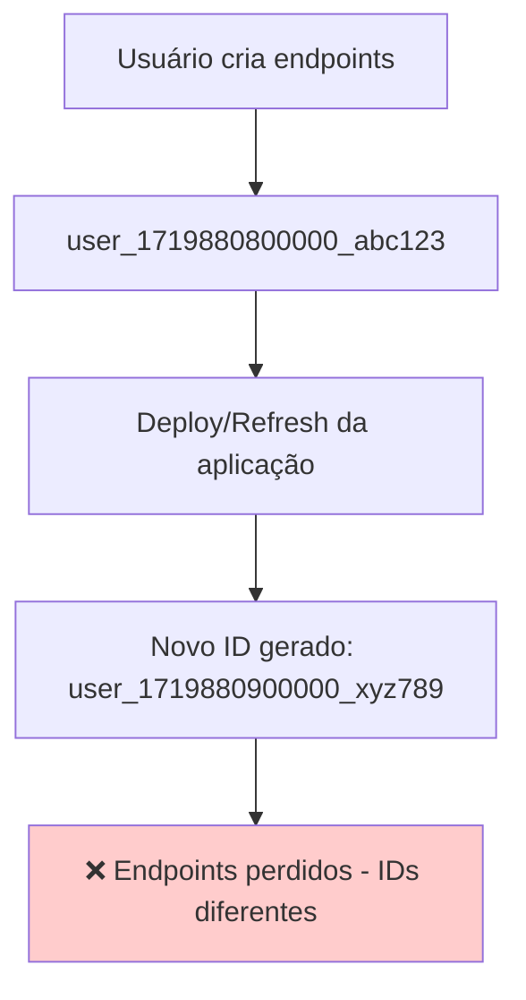

### Solução Implementada

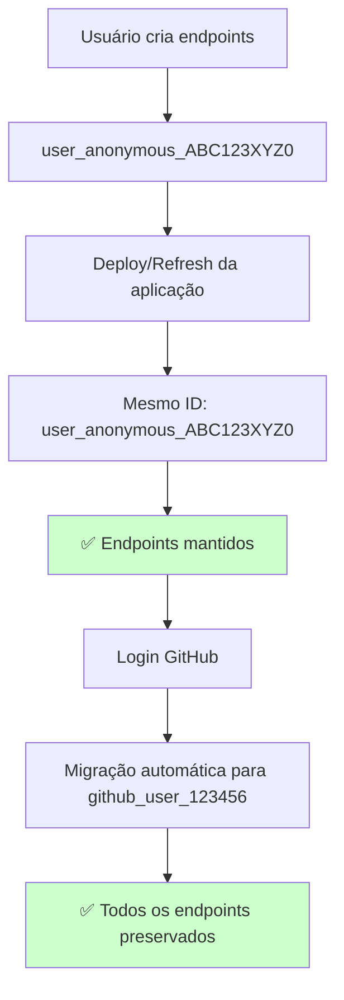

## 🏗️ Arquitetura da Solução

### Componentes Principais

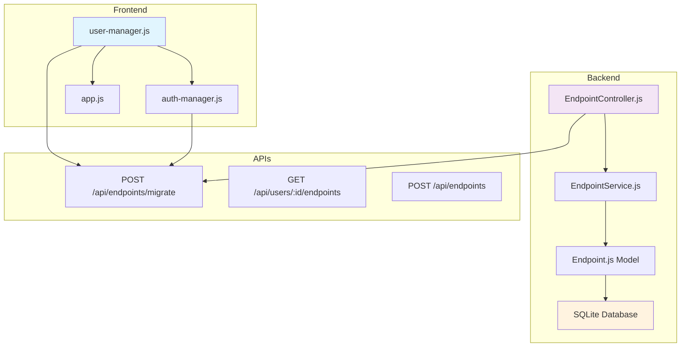

## 🔐 Fluxo de Autenticação

### Estados de Usuário

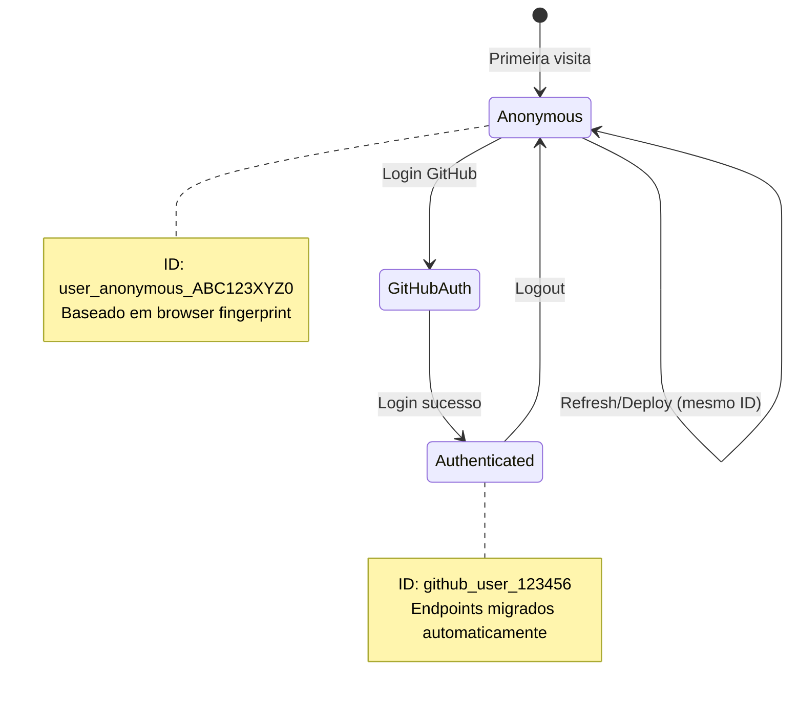

### Processo de Geração de ID

```mermaid
flowchart TD
    A[Usuário acessa aplicação] --> B{Existe ID no localStorage?}
    B -->|Sim| C[Usar ID existente]
    B -->|Não| D[Gerar novo ID]
    
    D --> E[Criar browser fingerprint]
    E --> F[userAgent + language + screen.width + screen.height]
    F --> G[btoa(fingerprint).replace(/[^a-zA-Z0-9]/g, '').substring(0, 10)]
    G --> H[user_anonymous_ + seed]
    H --> I[Salvar no localStorage]
    
    C --> J[ID Persistente]
    I --> J
    
    style J fill:#ccffcc
```

## 🔄 Sistema de Migração

### Fluxo Completo de Migração

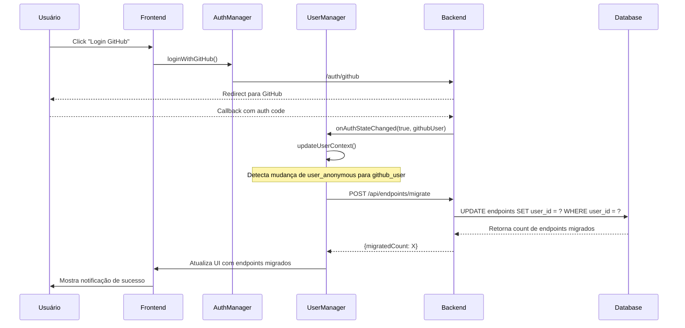

### Lógica de Decisão da Migração

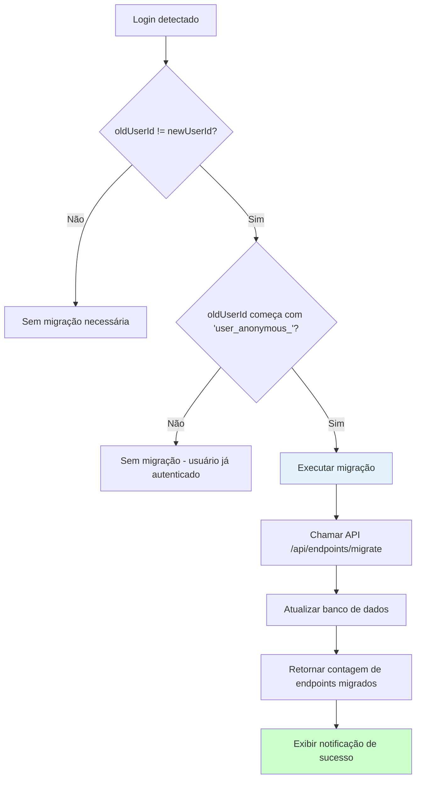

## 🧩 Componentes do Código

### 1. Frontend - user-manager.js

```javascript
// Função principal que gera ID persistente
generateUserId() {
    const browserFingerprint = navigator.userAgent + navigator.language + screen.width + screen.height;
    const seed = btoa(browserFingerprint).replace(/[^a-zA-Z0-9]/g, '').substring(0, 10);
    return 'user_anonymous_' + seed;
}

// Detecção e execução da migração
async updateUserContext() {
    if (this.isAuthenticated && this.githubUser) {
        const oldUserId = this.currentUser.id;
        const newUserId = this.githubUser.id;
        
        // Migração necessária?
        if (oldUserId !== newUserId && oldUserId.startsWith('user_anonymous_')) {
            await this.migrateEndpoints(oldUserId, newUserId);
        }
        
        this.currentUser.github_id = this.githubUser.id;
        this.currentUser.auth_type = 'github';
    }
}
```

### 2. Backend - EndpointController.js

```javascript
// Endpoint de migração
async migrateEndpoints(req, res) {
    try {
        const { from_user_id, to_user_id } = req.body;
        
        const result = await EndpointService.migrateEndpoints(from_user_id, to_user_id);
        
        res.json({
            message: 'Endpoints migrated successfully',
            migratedCount: result.migratedCount
        });
    } catch (error) {
        // Tratamento de erros apropriado
    }
}
```

### 3. Modelo de Dados - Endpoint.js

```javascript
// Migração no banco de dados
static async migrateUserEndpoints(fromUserId, toUserId) {
    const result = await Database.query(
        'UPDATE endpoints SET user_id = ? WHERE user_id = ?',
        [toUserId, fromUserId]
    );
    
    return {
        migratedCount: result.changes || 0
    };
}
```

### 4. Middleware de Validação

```javascript
// Validação dos dados de migração
const validateMigration = (req, res, next) => {
    const { from_user_id, to_user_id } = req.body;
    
    if (!from_user_id || !to_user_id) {
        return res.status(400).json({
            error: 'Both from_user_id and to_user_id are required'
        });
    }
    
    if (from_user_id === to_user_id) {
        return res.status(400).json({
            error: 'Source and destination user IDs cannot be the same'
        });
    }
    
    next();
};
```

## 📊 Casos de Uso

### Caso 1: Usuário Novo (Primeira Visita)

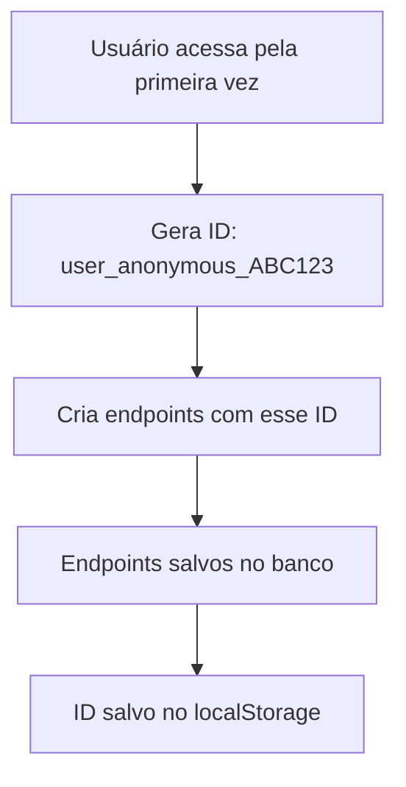

### Caso 2: Usuário Existente (Retorno)

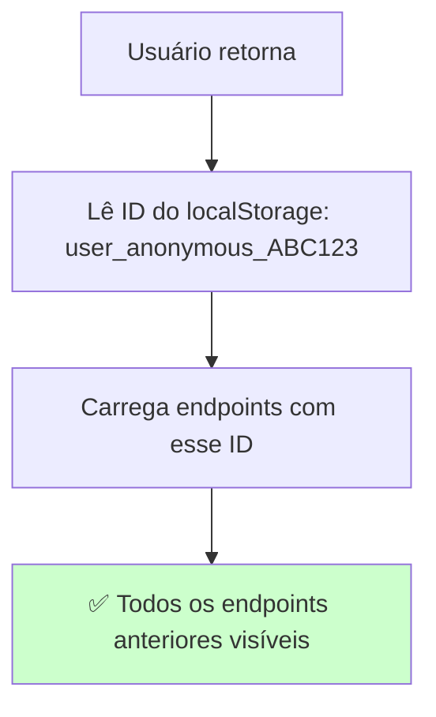

### Caso 3: Login com GitHub

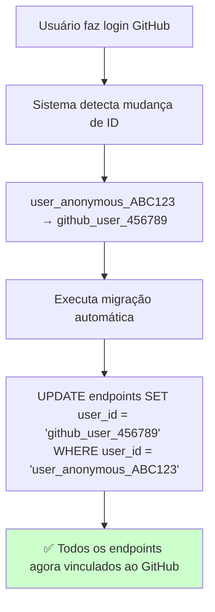

### Caso 4: Deploy/Refresh após Login

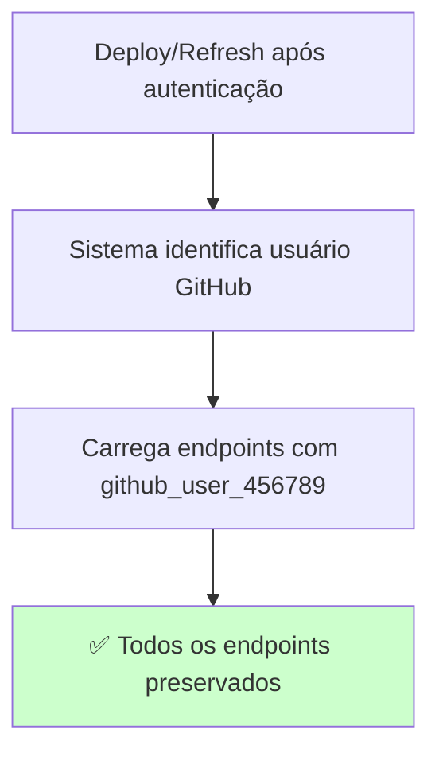

## 📡 API Documentation

### POST /api/endpoints/migrate

Migra todos os endpoints de um usuário para outro.

**Request:**
```json
{
    "from_user_id": "user_anonymous_ABC123XYZ0",
    "to_user_id": "github_user_123456"
}
```

**Response (Success):**
```json
{
    "message": "Endpoints migrated successfully",
    "migratedCount": 3
}
```

**Response (Error):**
```json
{
    "error": "Both from_user_id and to_user_id are required"
}
```

### GET /api/users/:userId/endpoints

Retorna todos os endpoints de um usuário específico.

**Response:**
```json
[
    {
        "id": "25f7deb6-18d8-4147-84a9-fec697627bd2",
        "name": "Test Endpoint",
        "user_id": "github_user_123456",
        "created_at": 1751424318603,
        "request_count": 0,
        "url": "http://localhost:3000/webhook/25f7deb6-18d8-4147-84a9-fec697627bd2"
    }
]
```

## 🔧 Configuração e Ambiente

### Variáveis de Ambiente

```bash
# Configuração do servidor
HOST=localhost  # ou 0.0.0.0 para bind em todas as interfaces
PORT=3000

# Configuração do banco de dados
DB_PATH=./webhooks.db
DB_MAX_CONNECTIONS=10
DB_TIMEOUT=30000

# GitHub OAuth (opcional)
GITHUB_CLIENT_ID=your_client_id
GITHUB_CLIENT_SECRET=your_client_secret
```

### Estrutura do Banco de Dados

```sql
-- Tabela de endpoints
CREATE TABLE endpoints (
    id TEXT PRIMARY KEY,
    name TEXT NOT NULL,
    user_id TEXT NOT NULL,  -- Campo chave para migração
    created_at INTEGER NOT NULL,
    request_count INTEGER DEFAULT 0
);

-- Índice para otimizar consultas por usuário
CREATE INDEX idx_endpoints_user_id ON endpoints(user_id);
```

## 🧪 Testes e Validação

### Fluxo de Teste Completo

```bash
# 1. Criar endpoint com usuário anônimo
curl -X POST http://localhost:3000/api/endpoints \
  -H "Content-Type: application/json" \
  -d '{"name": "Test Endpoint", "user_id": "user_anonymous_ABC123XYZ0"}'

# 2. Verificar endpoint criado
curl -X GET http://localhost:3000/api/users/user_anonymous_ABC123XYZ0/endpoints

# 3. Executar migração
curl -X POST http://localhost:3000/api/endpoints/migrate \
  -H "Content-Type: application/json" \
  -d '{"from_user_id": "user_anonymous_ABC123XYZ0", "to_user_id": "github_user_123456"}'

# 4. Verificar migração
curl -X GET http://localhost:3000/api/users/github_user_123456/endpoints
```

### Cenários de Teste

| Cenário | Estado Inicial | Ação | Resultado Esperado |
|---------|---------------|------|-------------------|
| Primeira visita | Sem localStorage | Gerar ID | `user_anonymous_XXXXXXXXXX` |
| Retorno | ID no localStorage | Carregar ID | Mesmo ID anterior |
| Login GitHub | Usuário anônimo | Autenticar | Migração automática |
| Refresh pós-login | Usuário autenticado | Recarregar | Endpoints do GitHub |

## 🚨 Tratamento de Erros

### Cenários de Erro

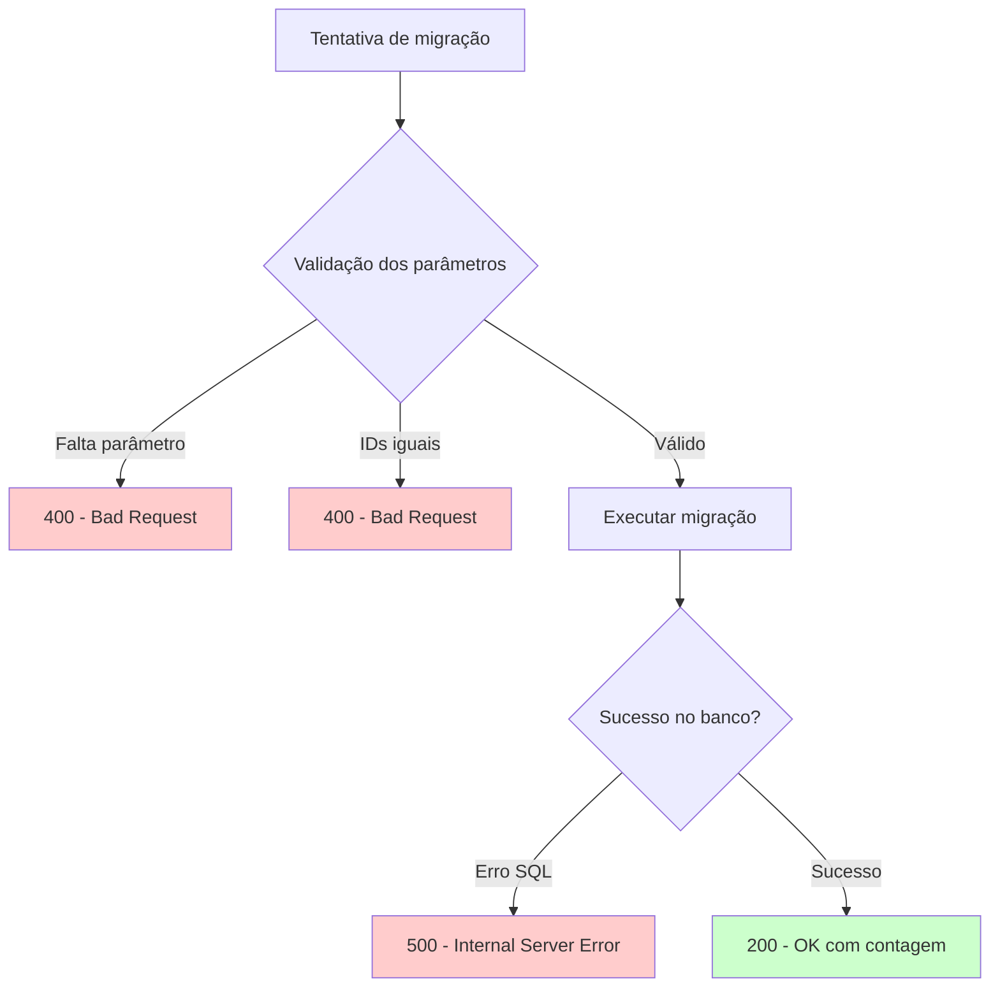

### Logs de Debug

```javascript
// Frontend
console.log(`Migrating endpoints from ${oldUserId} to ${newUserId}`);
console.log(`Successfully migrated ${result.migrated_count} endpoints`);

// Backend
logger.info('Endpoint migration requested', { from_user_id, to_user_id });
logger.info('Migration completed', { migratedCount: result.migratedCount });
```

## 🔒 Segurança

### Validações Implementadas

1. **Sanitização de entrada**: Parâmetros trimmed e validados
2. **Prevenção de SQL Injection**: Uso de prepared statements
3. **Validação de tipo**: Verificação de tipos de dados
4. **Rate limiting**: Implementado no middleware (se configurado)

### Browser Fingerprinting

```javascript
// Componentes do fingerprint (não identificam o usuário)
const fingerprint = {
    userAgent: navigator.userAgent,      // Informação do browser
    language: navigator.language,        // Idioma
    screenWidth: screen.width,           // Largura da tela
    screenHeight: screen.height          // Altura da tela
};
```

## 📈 Monitoramento e Métricas

### Métricas Importantes

- **Taxa de migração**: Quantos usuários fazem login e migram endpoints
- **Endpoints órfãos**: Endpoints com user_ids que não existem mais
- **Tempo de resposta**: Performance da API de migração
- **Erros de migração**: Falhas no processo

### Logs Estruturados

```json
{
    "timestamp": "2025-07-02T02:45:00.000Z",
    "level": "INFO",
    "message": "Endpoint migration completed",
    "data": {
        "from_user_id": "user_anonymous_ABC123XYZ0",
        "to_user_id": "github_user_123456",
        "migrated_count": 3,
        "duration_ms": 45
    }
}
```

## 🔮 Melhorias Futuras

### Funcionalidades Planejadas

1. **Migração em lote**: Migrar múltiplos usuários simultaneamente
2. **Histórico de migrações**: Rastrear todas as migrações realizadas
3. **Rollback**: Reverter migrações em caso de erro
4. **Dashboard admin**: Interface para gerenciar migrações

### Otimizações

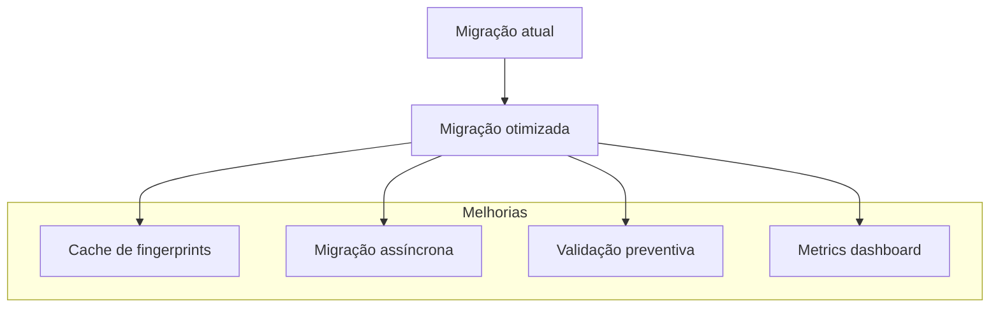

---

## 📞 Suporte

Para questões sobre esta implementação:

1. **Código**: Verifique os comentários inline nos arquivos
2. **Logs**: Consulte os logs estruturados da aplicação
3. **Testes**: Execute os cenários de teste documentados
4. **Debug**: Use as ferramentas de desenvolvedor do browser

Esta documentação cobre todo o sistema de migração de endpoints implementado no Hook Debug, garantindo que futuros desenvolvedores possam entender e manter o código eficientemente.