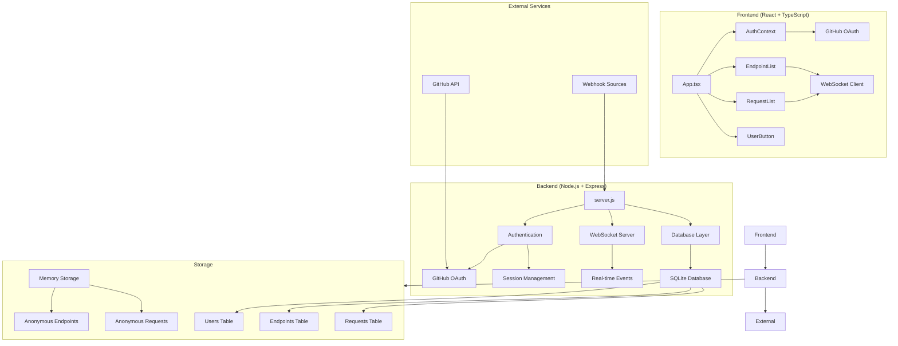
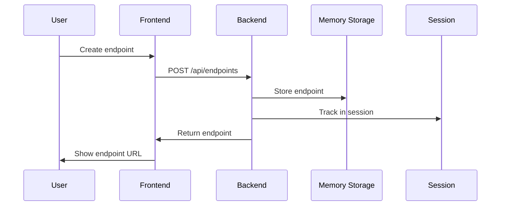
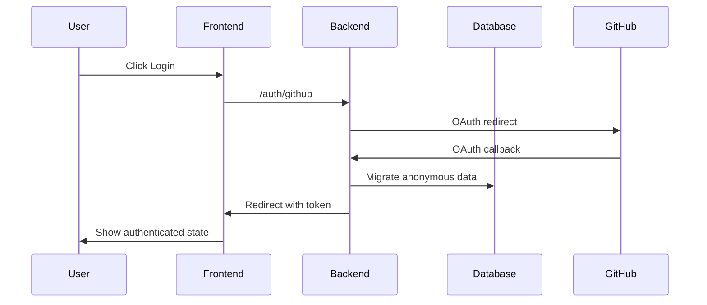

# HookDebug 🎯

[](https://opensource.org/licenses/MIT)
[](https://nodejs.org/)
[](https://reactjs.org/)
[](https://www.typescriptlang.org/)

HookDebug is a powerful, real-time webhook debugging tool that allows developers to create HTTP endpoints for testing webhooks and API requests. Think of it as a self-hosted alternative to webhook.site with enhanced features and privacy.

## ✨ Features

- 🔗 **Create Multiple Endpoints** - Generate unique HTTP endpoints instantly
- 🔄 **Real-time Monitoring** - See incoming requests live via WebSocket
- 👤 **Anonymous & Authenticated Usage** - Work without account or login with GitHub
- 📊 **Request History** - View detailed request information and history
- 🔍 **Request Inspection** - Examine headers, body, method, and more
- 🚀 **Cross-Platform** - Works on any device with a web browser
- 🐳 **Docker Support** - Easy deployment with Docker
- 🔐 **Privacy First** - Self-hosted solution for sensitive data

## 🏗️ Architecture



## 🚀 Quick Start

### Using Docker (Recommended)

1. **Clone the repository:**
```bash
git clone https://github.com/yourusername/hookdebug.git
cd hookdebug
```

2. **Run with Docker Compose:**
```bash
docker-compose up --build
```

3. **Access the application:**
   - Frontend: http://localhost:5173
   - Backend API: http://localhost:3001

### Local Development

1. **Prerequisites:**
   - Node.js 22+
   - npm

2. **Install dependencies:**
```bash
npm install
```

3. **Environment setup:**
```bash
cp .env.example .env
# Edit .env with your configuration
```

4. **Start the application:**
```bash
# Development mode with hot reload
npm run start:dev

# Production mode
npm run start
```

## 🔧 Configuration

### Environment Variables

Create a `.env` file in the root directory:

```bash
# Server Configuration
PORT=3001
NODE_ENV=development

# Frontend Configuration
FRONTEND_URL=http://localhost:5173
VITE_BACKEND_URL=http://localhost:3001

# Database
DB_PATH=./hookdebug.db

# Session Security
SESSION_SECRET=your-super-secret-session-key-change-this

# GitHub OAuth (Optional)
GITHUB_CLIENT_ID=your-github-client-id
GITHUB_CLIENT_SECRET=your-github-client-secret
```

### GitHub OAuth Setup (Optional)

1. Go to [GitHub Developer Settings](https://github.com/settings/developers)
2. Create a new OAuth App
3. Set Authorization callback URL to: `http://localhost:3001/auth/github/callback`
4. Add your Client ID and Secret to `.env`

## 📚 API Documentation

### Authentication Endpoints

```
GET  /auth/me              - Get current user
GET  /auth/github          - GitHub OAuth login
GET  /auth/github/callback - OAuth callback
POST /auth/logout          - Logout user
POST /auth/validate-token  - Validate auth token
GET  /auth/pending-migration - Check pending migrations
```

### Endpoint Management

```
GET    /api/endpoints      - List all endpoints
POST   /api/endpoints      - Create new endpoint
DELETE /api/endpoints/:id  - Delete endpoint
```

### Request Monitoring

```
GET /:path                 - Webhook receiver (any HTTP method)
GET /api/requests          - List requests for endpoints
```

### WebSocket Events

```
endpoint_created           - New endpoint created
endpoint_deleted          - Endpoint deleted
new_request               - New request received
```

## 🏛️ Database Schema

```sql
-- Users table
CREATE TABLE users (
    id INTEGER PRIMARY KEY AUTOINCREMENT,
    github_id TEXT UNIQUE NOT NULL,
    username TEXT NOT NULL,
    display_name TEXT,
    avatar_url TEXT,
    created_at DATETIME DEFAULT CURRENT_TIMESTAMP
);

-- Endpoints table
CREATE TABLE endpoints (
    id TEXT PRIMARY KEY,
    user_id INTEGER,
    name TEXT NOT NULL,
    path TEXT UNIQUE NOT NULL,
    created_at DATETIME DEFAULT CURRENT_TIMESTAMP,
    request_count INTEGER DEFAULT 0,
    FOREIGN KEY (user_id) REFERENCES users (id)
);

-- Requests table
CREATE TABLE requests (
    id TEXT PRIMARY KEY,
    endpoint_id TEXT NOT NULL,
    method TEXT NOT NULL,
    url TEXT NOT NULL,
    headers TEXT,
    body TEXT,
    timestamp DATETIME DEFAULT CURRENT_TIMESTAMP,
    FOREIGN KEY (endpoint_id) REFERENCES endpoints (id)
);
```

## 🔄 Data Flow

### Anonymous User Flow



### Authenticated User Flow



## 🛠️ Development

### Project Structure

```
hookdebug/
├── src/                    # Frontend source code
│   ├── components/         # React components
│   ├── contexts/          # React contexts
│   ├── hooks/             # Custom hooks
│   └── main.tsx           # Entry point
├── server.js              # Backend server
├── auth.js                # Authentication logic
├── database.js            # Database operations
├── docker-compose.yml     # Docker configuration
├── Dockerfile             # Docker image
└── package.json           # Dependencies
```

### Available Scripts

```bash
# Development
npm run dev          # Start frontend dev server
npm run server:dev   # Start backend with nodemon
npm run start:dev    # Start both frontend and backend

# Production
npm run build        # Build frontend for production
npm run preview      # Preview production build
npm run start        # Start production server

# Code Quality
npm run lint         # Run ESLint
```

### Testing

```bash
# Run tests in Docker (recommended)
docker-compose up --build

# Test endpoints
curl -X POST http://localhost:3001/webhook/test-endpoint \
  -H "Content-Type: application/json" \
  -d '{"test": "data"}'
```

## 🤝 Contributing

We welcome contributions! Please follow these guidelines:

### Getting Started

1. **Fork the repository**
2. **Create a feature branch:**
   ```bash
   git checkout -b feature/amazing-feature
   ```
3. **Make your changes**
4. **Test thoroughly**
5. **Commit your changes:**
   ```bash
   git commit -m "Add amazing feature"
   ```
6. **Push to your fork:**
   ```bash
   git push origin feature/amazing-feature
   ```
7. **Create a Pull Request**

### Code Style

- Use TypeScript for type safety
- Follow ESLint configuration
- Write descriptive commit messages
- Add tests for new features
- Update documentation as needed

### Testing Guidelines

- **IMPORTANT**: All tests MUST be run using Docker containers
- Never run tests locally on the development machine
- Use the provided Docker configuration for consistent testing environments

## 📦 Deployment

### Docker Deployment

1. **Build the image:**
```bash
docker build -t hookdebug .
```

2. **Run the container:**
```bash
docker run -p 3001:3001 -p 5173:5173 hookdebug
```

### Production Deployment

1. **Environment setup:**
```bash
NODE_ENV=production
FRONTEND_URL=https://your-domain.com
GITHUB_CLIENT_ID=your-production-client-id
GITHUB_CLIENT_SECRET=your-production-client-secret
```

2. **Build and start:**
```bash
npm run build
npm run start
```

## 🔧 Troubleshooting

### Common Issues

**Sessions not persisting during OAuth:**
- Check session configuration in `server.js`
- Verify CORS settings
- Ensure proper domain configuration

**Endpoints not migrating on login:**
- Check server logs for migration errors
- Verify database permissions
- Ensure session is properly saved

**WebSocket connection issues:**
- Verify CORS configuration
- Check firewall settings
- Ensure proper WebSocket support

### Debug Mode

Enable debug logging:
```bash
DEBUG=hookdebug* npm run start:dev
```

## 📋 Roadmap

- [ ] Request filtering and search
- [ ] Export request history
- [ ] Request forwarding/proxying
- [ ] Custom response configuration
- [ ] Request replay functionality
- [ ] API rate limiting
- [ ] Request validation rules
- [ ] Multi-tenant support
- [ ] Performance analytics
- [ ] Mobile app

## 📄 License

This project is licensed under the MIT License - see the [LICENSE](LICENSE) file for details.

## 🙏 Acknowledgments

- Built with React, Node.js, and TypeScript
- Inspired by webhook.site and similar tools
- WebSocket real-time communication
- SQLite for lightweight data storage

## 📞 Support

- 🐛 **Bug Reports**: [GitHub Issues](https://github.com/yourusername/hookdebug/issues)
- 💡 **Feature Requests**: [GitHub Discussions](https://github.com/yourusername/hookdebug/discussions)
- 📧 **Contact**: [your-email@example.com](mailto:your-email@example.com)

---

Made with ❤️ by the HookDebug community