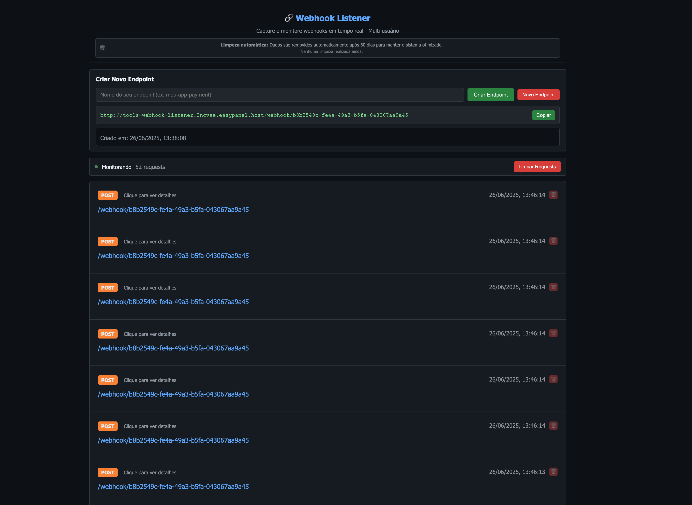
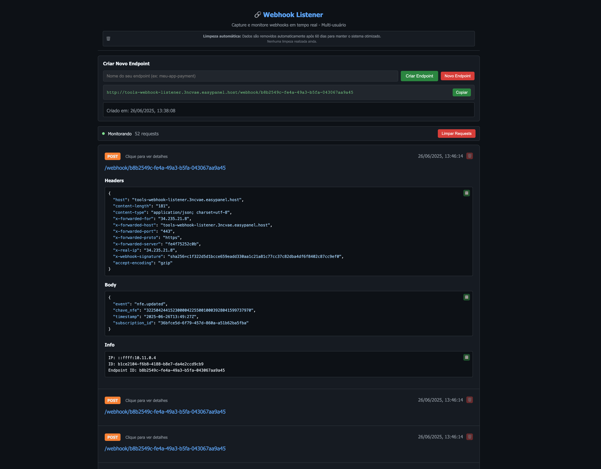

# 🔗 Webhook Listener

[](https://nodejs.org/)
[](LICENSE)
[](CONTRIBUTING.md)

> **The ultimate webhook debugging companion for developers** 🚀

A powerful, self-hosted alternative to webhook.site that captures, inspects, and monitors HTTP requests in real-time. Perfect for API development, webhook debugging, and integration testing.

## 👀 See It In Action




*Real-time webhook capture with instant multilingual interface, dark theme, and detailed request inspection*

## 🎯 Why Choose Webhook Listener?

### 🔥 **For Developers Who Need More**
- **🌐 Global Ready**: Built-in Portuguese and English support with easy language switching
- **⚡ Lightning Fast**: Real-time updates with Socket.io - no page refreshes needed
- **🎨 Beautiful UI**: Modern dark theme that's easy on the eyes during long debugging sessions
- **🔒 Private & Secure**: Self-hosted solution - your webhook data stays under your control
- **🛠️ Developer Friendly**: Clean API, comprehensive docs, and extensible architecture

### 🚀 **Perfect For**
- **API Integration Testing** - Debug payment gateways, notification services, and third-party APIs
- **Webhook Development** - Test your webhook implementations before going live
- **Team Collaboration** - Share webhook endpoints across your development team
- **Production Monitoring** - Capture and analyze production webhook traffic
- **Learning & Teaching** - Understand HTTP requests and webhook patterns

### 💡 **What Makes It Special**
Unlike other webhook debugging tools, Webhook Listener offers:
- **Persistent Local Storage** - Your webhook history is saved locally
- **Multi-Language Support** - Interface adapts to your preferred language
- **Advanced Filtering** - Find specific requests quickly with powerful search
- **Request Replay** - Easily copy and replay webhook requests for testing
- **No Limits** - Capture unlimited webhooks without rate limits or paywall restrictions

## 🌟 Features

- 🌐 **Multilingual Support** - Portuguese (pt-BR) and English with localStorage persistence
- 📡 **Universal Capture** - Support for all HTTP methods (GET, POST, PUT, DELETE, PATCH, etc.)
- 🎨 **Modern Interface** - Responsive design with dark theme and optimized UX
- 💾 **Local Persistence** - SQLite database with optimized indexes for performance
- 🔄 **Real-time Updates** - Socket.io for instant updates without polling
- 📊 **Complete Analysis** - Capture headers, body, query params, and request metadata
- 🧹 **Smart Cleanup** - Automatic data cleanup with atomic transactions
- 📋 **RESTful API** - Standardized endpoints for external integration
- 🔒 **Security** - Data sanitization and input validation
- 📱 **Multi-user Ready** - Support for multiple concurrent endpoints

## 🚀 Quick Start

### Prerequisites

- Node.js >= 18.0.0
- npm >= 8.0.0

### Installation

```bash
# Clone the repository
git clone https://github.com/your-username/webhook-listener.git
cd webhook-listener

# Install dependencies
npm install

# Start the application
npm start
```

The server will be available at `http://localhost:3000`

### Development Mode

```bash
# Development with hot reload
npm run dev

# Debug mode with detailed logs
DEBUG=webhook-listener:* npm run dev
```

## 🎯 Usage

### Creating Your First Endpoint

1. **Access the Web Interface**
   - Open `http://localhost:3000` in your browser
   - Use the language selector (🌐) to choose your preferred language

2. **Create a Webhook Endpoint**
   - Enter a name for your endpoint (e.g., "my-app-payment")
   - Click "Create Endpoint" / "Criar Endpoint"
   - Copy the generated webhook URL

3. **Start Receiving Webhooks**
   - Configure your applications to send webhooks to the generated URL
   - Watch requests appear in real-time
   - Click on any request to see detailed information

### Example Webhook Test

```bash
# Send a test webhook
curl -X POST http://localhost:3000/webhook/my-endpoint/payment \
  -H "Content-Type: application/json" \
  -H "X-Signature: sha256=abc123" \
  -d '{
    "event": "payment.completed",
    "transaction_id": "tx_12345",
    "amount": 99.99,
    "currency": "USD"
  }'
```

## 🏗️ Architecture

### Technology Stack

- **Backend**: Node.js + Express.js
- **Frontend**: HTML5, CSS3, JavaScript ES6+
- **Database**: SQLite with optimized schema
- **Real-time**: Socket.io for bidirectional communication
- **Internationalization**: Custom i18n system with localStorage persistence
- **Styling**: Modern CSS with native dark theme

### Project Structure

```
webhook-listener/
├── server.js              # Main server application
├── public/                 # Static assets and client-side code
│   ├── index.html         # Main web interface
│   ├── app.js             # Client-side JavaScript
│   ├── style.css          # Styles and dark theme
│   └── i18n.js            # Internationalization system
├── screenshots/           # Visual documentation
├── webhooks.db           # SQLite database (auto-generated)
├── package.json          # Dependencies and scripts
└── README.md             # This file
```

## 📊 API Reference

### Core Endpoints

| Method | Endpoint | Description | Parameters |
|--------|----------|-------------|------------|
| `GET` | `/` | Main web interface | - |
| `GET` | `/api/requests` | List captured requests | `?limit=N&offset=N` |
| `DELETE` | `/api/requests` | Clear all requests | - |
| `DELETE` | `/api/requests/:id` | Delete specific request | `id` (path param) |
| `ALL` | `/webhook/*` | Universal webhook capture | Accepts any path |

### Endpoint Management

| Method | Endpoint | Description | Body |
|--------|----------|-------------|------|
| `POST` | `/api/endpoints` | Create new endpoint | `{"name": "endpoint-name"}` |
| `GET` | `/api/endpoints/:id/requests` | Get endpoint requests | - |
| `DELETE` | `/api/endpoints/:id/requests` | Clear endpoint requests | - |

### Response Format

```json
{
  "id": "uuid-v4",
  "timestamp": "2023-12-01T10:30:00.000Z",
  "method": "POST",
  "url": "/webhook/payment/success",
  "headers": {
    "content-type": "application/json",
    "user-agent": "PaymentGateway/1.0"
  },
  "body": "{\"transaction_id\": \"tx_123\"}",
  "query": {"status": "success"},
  "ip": "192.168.1.100",
  "userAgent": "PaymentGateway/1.0",
  "endpoint_id": "endpoint-uuid"
}
```

## 🌐 Internationalization

The application supports multiple languages with persistent user preferences:

### Supported Languages

- 🇧🇷 **Portuguese (pt-BR)** - Default language
- 🇺🇸 **English (en)** - Full translation coverage

### Adding New Languages

1. **Update Translation Files**
   ```javascript
   // In public/i18n.js, add new language to translations object
   'es': {
     'app.title': 'Webhook Listener',
     'app.subtitle': 'Captura y monitorea webhooks en tiempo real',
     // ... more translations
   }
   ```

2. **Add Language Option**
   ```html
   <!-- In public/index.html -->
   <option value="es" data-i18n="language.spanish">Español</option>
   ```

3. **Test the Implementation**
   ```bash
   npm start
   # Test language switching in the browser
   ```

## 🛠️ Development

### Setting Up Development Environment

1. **Fork and Clone**
   ```bash
   git clone https://github.com/your-username/webhook-listener.git
   cd webhook-listener
   npm install
   ```

2. **Environment Variables** (Optional)
   ```bash
   cp .env.example .env
   # Edit .env with your preferences
   ```

3. **Database Configuration**
   ```bash
   # SQLite database is created automatically
   # Location: ./webhooks.db
   ```

### Running Tests

```bash
# Run the application
npm start

# In another terminal, run test webhooks
npm run test:webhooks
```

### Code Style and Linting

```bash
# Check code style
npm run lint

# Fix auto-fixable issues
npm run lint:fix

# Format code
npm run format
```

### Database Schema

```sql
-- Endpoints table
CREATE TABLE endpoints (
  id TEXT PRIMARY KEY,
  name TEXT UNIQUE NOT NULL,
  created_at DATETIME DEFAULT CURRENT_TIMESTAMP
);

-- Requests table
CREATE TABLE requests (
  id TEXT PRIMARY KEY,
  endpoint_id TEXT NOT NULL,
  timestamp DATETIME DEFAULT CURRENT_TIMESTAMP,
  method TEXT NOT NULL,
  url TEXT NOT NULL,
  headers TEXT,
  body TEXT,
  query TEXT,
  ip TEXT,
  userAgent TEXT,
  FOREIGN KEY (endpoint_id) REFERENCES endpoints (id)
);

-- Indexes for performance
CREATE INDEX idx_requests_timestamp ON requests(timestamp);
CREATE INDEX idx_requests_endpoint ON requests(endpoint_id);
CREATE INDEX idx_requests_method ON requests(method);
```

## 🐳 Docker Deployment

### Using Docker

```bash
# Build the image
docker build -t webhook-listener .

# Run the container
docker run -p 3000:3000 -v $(pwd)/data:/app/data webhook-listener
```

### Docker Compose

```yaml
version: '3.8'
services:
  webhook-listener:
    build: .
    ports:
      - "3000:3000"
    volumes:
      - ./data:/app/data
    environment:
      - NODE_ENV=production
      - PORT=3000
    restart: unless-stopped
```

## 🔧 Configuration

### Environment Variables

| Variable | Default | Description |
|----------|---------|-------------|
| `PORT` | `3000` | Server port |
| `NODE_ENV` | `development` | Environment mode |
| `DB_PATH` | `./webhooks.db` | SQLite database path |
| `CLEANUP_SCHEDULE` | `0 3 * * *` | Cron pattern for cleanup |
| `DATA_RETENTION_DAYS` | `60` | Days to keep webhook data |

### Advanced Configuration

```javascript
// config/default.json
{
  "server": {
    "port": 3000,
    "host": "0.0.0.0"
  },
  "database": {
    "path": "./webhooks.db",
    "maxConnections": 10
  },
  "cleanup": {
    "schedule": "0 3 * * *",
    "retentionDays": 60
  },
  "i18n": {
    "defaultLanguage": "pt-BR",
    "fallbackLanguage": "en"
  }
}
```

## 📈 Performance and Monitoring

### Performance Optimizations

- **Database Indexes** - Optimized for timestamp and method queries
- **Connection Pooling** - Efficient database connection management
- **Lazy Loading** - Syntax highlighting applied only when needed
- **Request Debouncing** - Prevents excessive API calls
- **Memory Management** - Automatic cleanup of old data

### Monitoring

```bash
# Production logs
NODE_ENV=production npm start 2>&1 | tee webhook-listener.log

# Real-time monitoring
tail -f webhook-listener.log

# Performance monitoring
npm run monitor
```

### Health Check Endpoint

```bash
# Check application health
curl http://localhost:3000/health

# Response
{
  "status": "healthy",
  "uptime": 3600,
  "database": "connected",
  "memory": "45.2MB"
}
```

## 🤝 Contributing

We welcome contributions! Please see our [Contributing Guide](CONTRIBUTING.md) for details.

### Quick Contribution Steps

1. **Fork the repository**
2. **Create a feature branch**
   ```bash
   git checkout -b feature/amazing-feature
   ```
3. **Make your changes**
4. **Add tests if applicable**
5. **Commit with conventional format**
   ```bash
   git commit -m "feat: add amazing feature"
   ```
6. **Push and create a Pull Request**

### Development Guidelines

- Follow [Conventional Commits](https://conventionalcommits.org/)
- Add tests for new features
- Update documentation as needed
- Ensure all tests pass
- Follow the existing code style

## 🔒 Security

### Security Features

- **Input Sanitization** - All user inputs are sanitized
- **SQL Injection Protection** - Parameterized queries
- **XSS Prevention** - Content Security Policy headers
- **Rate Limiting** - Protection against abuse
- **Data Validation** - Schema validation for all inputs

### Reporting Security Issues

Please report security vulnerabilities to [security@webhook-listener.com](mailto:security@webhook-listener.com) or open a private security advisory on GitHub.

## 📄 License

This project is licensed under the MIT License - see the [LICENSE](LICENSE) file for details.

## 🙏 Acknowledgments

- Inspired by [webhook.site](https://webhook.site)
- Built with [Node.js](https://nodejs.org/) and [Socket.io](https://socket.io/)
- Dark theme inspired by GitHub's design system
- Internationalization following W3C standards

## 📞 Support

- **Documentation**: [Wiki](https://github.com/your-username/webhook-listener/wiki)
- **Issues**: [GitHub Issues](https://github.com/your-username/webhook-listener/issues)
- **Discussions**: [GitHub Discussions](https://github.com/your-username/webhook-listener/discussions)
- **Email**: [support@webhook-listener.com](mailto:support@webhook-listener.com)

---

**Made with ❤️ by the community** | **Star ⭐ this repo if you find it useful!**